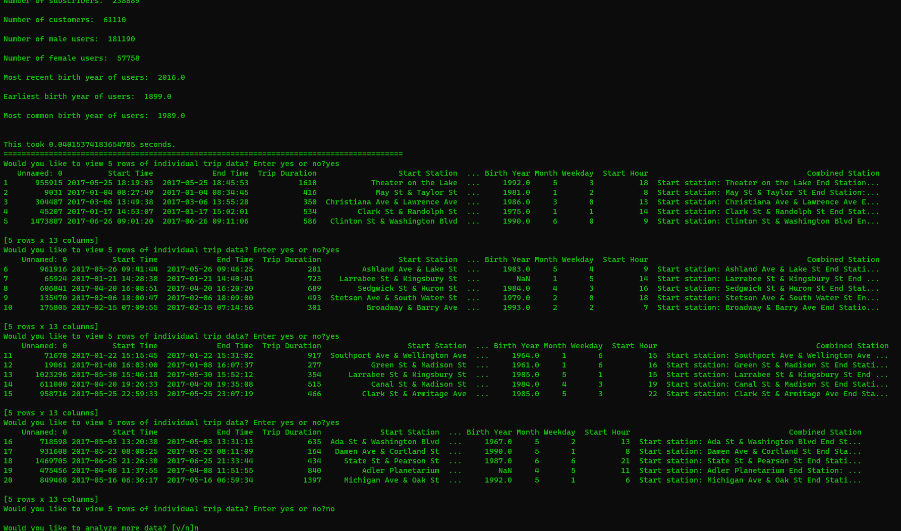

# Udacity US bikeshare project

## Overview

This project will make use of Python to explore data related to bike share systems for three major cities in the United States—Chicago, New York City, and Washington. A program is written to import the data and answer interesting questions about it by computing descriptive statistics. A script will also be written to take in raw input to create an interactive experience in the terminal to present these statistics.

## Software Needed
   - Python
   - text editor such as Sublime or Atom
   - terminal application (git bash, anaconda terminal)

## The Datasets

Randomly selected data for the first six months of 2017 are provided for all three cities. All three of the data files contain the same core six (6) columns:

   - Start Time (e.g., 2017-01-01 00:07:57)
   - End Time (e.g., 2017-01-01 00:20:53)
   - Trip Duration (in seconds - e.g., 776)
   - Start Station (e.g., Broadway & Barry Ave)
   - End Station (e.g., Sedgwick St & North Ave)
   - User Type (Subscriber or Customer)

The Chicago and New York City files also have the following two columns:

   - Gender
   - Birth Year

## Statistics Computed

This project will calculate and provide the following information

1. Popular times of travel (i.e., occurs most often in the start time)

   - most common month
   - most common day of week
   - most common hour of day

2. Popular stations and trip

   - most common start station
   - most common end station
   - most common trip from start to end (i.e., most frequent combination of start station and end station)

3. Trip duration

   - total travel time
   - average travel time

4. User info

   - counts of each user type
   - counts of each gender (only available for NYC and Chicago)
   - earliest, most recent, most common year of birth (only available for NYC and Chicago)

## The Files

Three city dataset files are given:

   - chicago.csv
   - new_york_city.csv
   - washington.csv

## Sample output

## Disclaimer

Data and project information were kindly provided by [Udacity](https://www.udacity.com/).